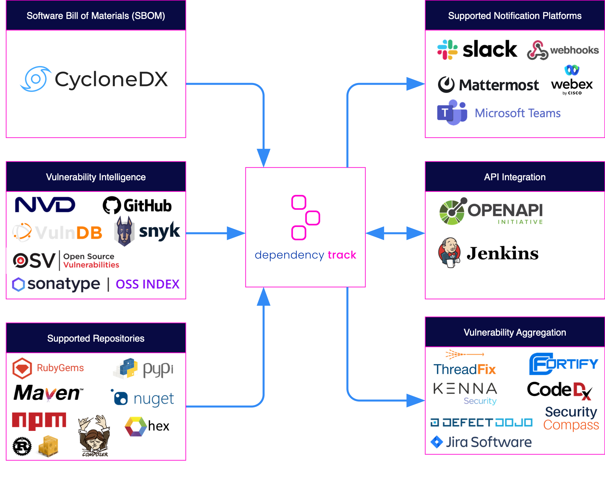

[](https://github.com/DependencyTrack/dependency-track/actions?workflow=CI+Build)
[](https://www.codacy.com/gh/DependencyTrack/dependency-track/dashboard?utm_source=github.com&amp;utm_medium=referral&amp;utm_content=DependencyTrack/dependency-track&amp;utm_campaign=Badge_Grade)
[](https://github.com/stevespringett/Alpine)
[![License][license-image]][Apache License 2.0]
[](https://www.owasp.org/index.php/OWASP_Dependency_Track_Project)
[](https://dependencytrack.org/)
[](https://docs.dependencytrack.org/)
[](https://dependencytrack.org/slack)
[](https://dependencytrack.org/discussion)
[](https://dependencytrack.org/youtube)
[](https://twitter.com/dependencytrack)
[](https://github.com/DependencyTrack/dependency-track/releases)
[](https://github.com/DependencyTrack/dependency-track/releases)
[](https://hub.docker.com/r/dependencytrack/apiserver/)
[](https://hub.docker.com/r/dependencytrack/frontend/)
[](https://hub.docker.com/r/dependencytrack/bundled/)
[](https://hub.docker.com/r/owasp/dependency-track/)


Dependency-Track is an intelligent [Component Analysis] platform that allows organizations to
identify and reduce risk in the software supply chain. Dependency-Track takes a unique
and highly beneficial approach by leveraging the capabilities of [Software Bill of Materials] (SBOM). This approach
provides capabilities that traditional Software Composition Analysis (SCA) solutions cannot achieve.

Dependency-Track monitors component usage across all versions of every application in its portfolio in order to
proactively identify risk across an organization. The platform has an API-first design and is ideal for use in
CI/CD environments.

<p align="center">
  <a href="https://www.youtube.com/watch?v=cQuk6jKTrTs">
    
  </a>
</p>


## Ecosystem Overview


## Features
* Component support for:
  * Applications
  * Libraries
  * Frameworks
  * Operating systems
  * Containers
  * Firmware
  * Files
  * Hardware
* Tracks component usage across every application in an organizations portfolio
* Quickly identify what is affected, and where
* Identifies multiple forms of risk including
  * Components with known vulnerabilities
  * Out-of-date components
  * Modified components
  * License risk
  * More coming soon...
* Integrates with multiple sources of vulnerability intelligence including:
  * [National Vulnerability Database] (NVD)
  * [GitHub Advisories]
  * [Sonatype OSS Index]
  * [VulnDB] from [Risk Based Security]
  * More coming soon.
* Robust policy engine with support for global and per-project policies
  * Security risk and compliance
  * License risk and compliance
  * Operational risk and compliance  
* Ecosystem agnostic with built-in repository support for:
  * Cargo (Rust)
  * Composer (PHP)
  * Gems (Ruby)
  * Hex (Erlang/Elixir)
  * Maven (Java)
  * NPM (Javascript)
  * NuGet (.NET)
  * Pypi (Python)
  * More coming soon.  
* Identifies APIs and external service components including:
  * Service provider
  * Endpoint URIs
  * Data classification
  * Directional flow of data
  * Trust boundary traversal
  * Authentication requirements
* Includes a comprehensive auditing workflow for triaging results
* Configurable notifications supporting Slack, Microsoft Teams, Mattermost, WebEx, Webhooks and Email
* Supports standardized SPDX license ID’s and tracks license use by component
* Supports importing [CycloneDX] Software Bill of Materials (SBOM)
* Easy to read metrics for components, projects, and portfolio
* Native support for Kenna Security, Fortify SSC, ThreadFix, and DefectDojo
* API-first design facilitates easy integration with other systems
* API documentation available in OpenAPI format
* OAuth 2.0 + OpenID Connect (OIDC) support for single sign-on (authN/authZ)
* Supports internally managed users, Active Directory/LDAP, and API Keys
* Simple to install and configure. Get up and running in just a few minutes


<hr>


### Quickstart (Docker Compose)

```bash
# Downloads the latest Docker Compose file
curl -LO https://dependencytrack.org/docker-compose.yml

# Starts the stack using Docker Compose
docker-compose up -d
```

### Quickstart (Docker Swarm)

```bash
# Downloads the latest Docker Compose file
curl -LO https://dependencytrack.org/docker-compose.yml

# Initializes Docker Swarm (if not previously initialized)
docker swarm init

# Starts the stack using Docker Swarm
docker stack deploy -c docker-compose.yml dtrack
```

### Quickstart (Manual Execution)

```bash
# Pull the image from the Docker Hub OWASP repo
docker pull dependencytrack/bundled

# Creates a dedicated volume where data can be stored outside the container
docker volume create --name dependency-track

# Run the bundled container with 8GB RAM on port 8080
docker run -d -m 8192m -p 8080:8080 --name dependency-track -v dependency-track:/data dependencytrack/bundled
```

**NOTICE: Always use official binary releases in production.**

## Distributions

Dependency-Track has four distribution variants. They are:

| Package | Package Format | Recommended | Supported | Docker | Download |
| :---------- | :---------- | :---------: | :---------: | :---------: | :---------: |
| API Server | Executable WAR | ✅ | ✅ | ✅ | ✅ | 
| Frontend | Single Page Application | ✅ | ✅ | ✅ | ✅ |
| Bundled | Executable WAR | ❌ | ☑️ | ✅ | ✅ |
| Traditional WAR | WAR | ❌ | ❌ | ❌ | ✅ |


#### API Server

The API Server contains an embedded Jetty server and all server-side functionality, but excludes the frontend user
interface. This variant is new as of Dependency-Track v4.0.

#### Frontend

The Frontend is the user interface that is accessible in a web browser. The Frontend is a Single Page Application (SPA)
that can be deployed independently of the Dependency-Track API Server. This variant is new as of Dependency-Track v3.8.

#### Bundled

The Bundled variant combines the API Server and the Frontend user interface. This variant was previously referred to as
the executable war and was the preferred distribution from Dependency-Track v3.0 - v3.8. This variant is supported but
deprecated and will be discontinued in a future release.

#### Traditional

The Traditional variant combines the API Server and the Frontend user interface and must be deployed to a Servlet
container. This variant is not supported, deprecated, and will be discontinued in a future release.

## Deploying on Kubernetes with Helm
You can install on Kubernetes using the [community-maintained chart](https://github.com/evryfs/helm-charts/tree/master/charts/dependency-track) like this:

Helm v3:
```shell
helm repo add evryfs-oss https://evryfs.github.io/helm-charts/
helm install dependency-track evryfs-oss/dependency-track --namespace dependency-track --create-namespace
```

Helm v2:
```shell
helm repo add evryfs-oss https://evryfs.github.io/helm-charts/
helm install evryfs-oss/dependency-track --name dependency-track --namespace dependency-track --create-namespace
```

by default, it will install PostgreSQL and use persistent volume claims for the data-directory used for vulnerability feeds.

## Contributing

Interested in contributing to Dependency-Track? Please check [`CONTRIBUTING.md`](./CONTRIBUTING.md) to see how you can help!

## Resources

* Website: <https://dependencytrack.org/>
* Documentation: <https://docs.dependencytrack.org/>
* Component Analysis: <https://owasp.org/www-community/Component_Analysis>

## Community

* Twitter: <https://dependencytrack.org/twitter>
* YouTube: <https://dependencytrack.org/youtube>
* Slack: <https://dependencytrack.org/slack> (Invite:  <https://dependencytrack.org/slack/invite>)
* Discussion (Groups.io): <https://dependencytrack.org/discussion>

## Copyright & License
Dependency-Track is Copyright (c) Steve Springett. All Rights Reserved.

Permission to modify and redistribute is granted under the terms of the
[Apache License 2.0].

Dependency-Track makes use of several other open source libraries. Please see
the [notices] file for more information.

  [National Vulnerability Database]: https://nvd.nist.gov
  [GitHub Advisories]: https://www.github.com/advisories
  [Sonatype OSS Index]: https://ossindex.sonatype.org
  [VulnDB]: https://vulndb.cyberriskanalytics.com
  [Risk Based Security]: https://www.riskbasedsecurity.com
  [Component Analysis]: https://owasp.org/www-community/Component_Analysis
  [Software Bill of Materials]: https://owasp.org/www-community/Component_Analysis#software-bill-of-materials-sbom
  [CycloneDX]: https://cyclonedx.org
  [license-image]: https://img.shields.io/badge/license-apache%20v2-brightgreen.svg
  [Apache License 2.0]: https://github.com/DependencyTrack/dependency-track/blob/master/LICENSE.txt
  [notices]: https://github.com/DependencyTrack/dependency-track/blob/master/NOTICES.txt
  [Alpine]: https://github.com/stevespringett/Alpine
