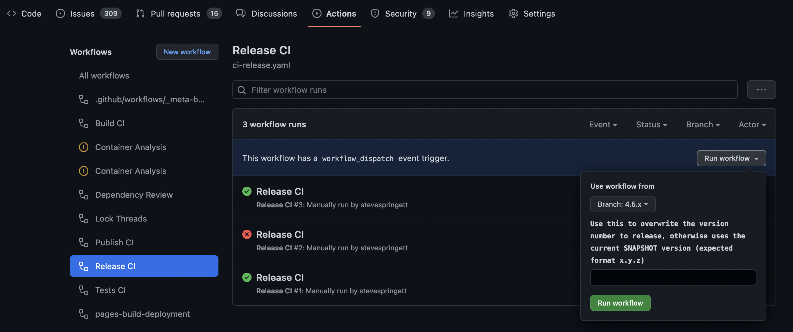

# Releasing OWASP Dependency-Track

This document describes the process of releasing a new version of Dependency-Track via GitHub Actions.

## Release a new major or minor version

1. Ensure the current state in `master` is ready to be released
2. Head over to the *Actions* tab in GitHub
3. Select the *Release CI* entry in the *Workflows* section
4. The following UI element will have a button to trigger the workflow. Once clicked, the *Use workflow from* dialog will appear:

5. Ensure that `master` is selected in the branch dropdown
6. OPTIONAL. If the version you intend to release differs from the version in the branch you can overwrite it by specifying it in the input variable designated for it
7. Finally, once all inputs are checked press the *Run Workflow* button

## Release a new bugfix version

1. Ensure the current state in the release branch is ready to be released
2. Head over to the *Actions* tab in GitHub
3. Select the *Release CI* entry in the *Workflows* section
4. The following UI element will have a button to trigger the workflow. Once clicked, the *Use workflow from* dialog will appear:

5. Ensure that a release branch (e.g. `4.5.x`) is selected in the branch dropdown
6. OPTIONAL. If the version you intend to release differs from the version in the branch you can overwrite it by specifying it in the input variable designated for it
7. Finally, once all inputs are checked press the *Run Workflow* button
