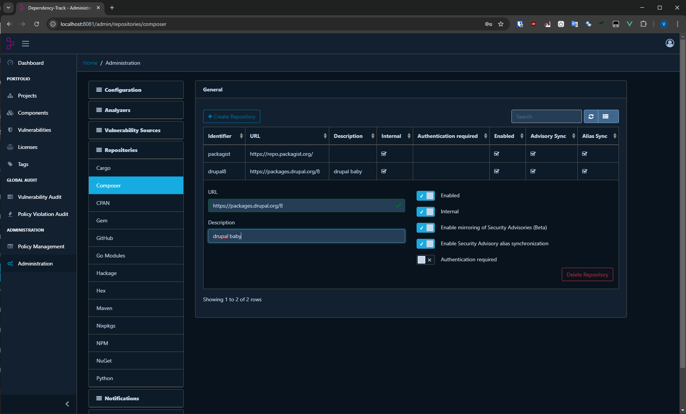

[Composer Advisories](https://blog.packagist.com/discover-security-advisories-with-composers-audit-command/) (PKSA) is a database of CVEs and other vulnerabilities affecting the Composer packages. Advisories may or may not be documented in the [National Vulnerability Database]({{ site.baseurl }}).

Dependency-Track integrates with Composer by mirroring advisories via each repositories  [Packagist API](https://packagist.org/apidoc).
The mirroring (and alias synchronization) can be enabled/disabled [per repository]({{ site.baseurl }}).
The mirror is refreshed daily, or upon restart of the Dependency-Track instance.

