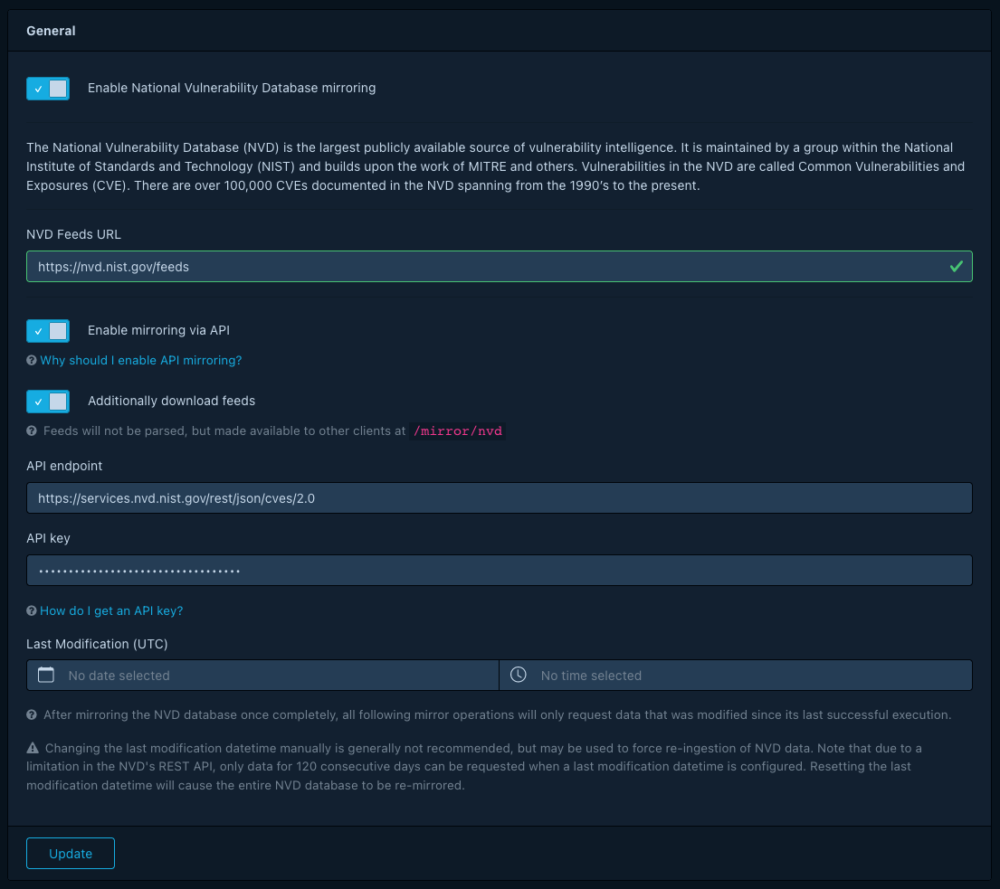

> This product uses the NVD API but is not endorsed or certified by the NVD.

The National Vulnerability Database (NVD) is the largest publicly available source of vulnerability intelligence.
It is maintained by a group within the National Institute of Standards and Technology (NIST) and builds upon the
work of MITRE and others. Vulnerabilities in the NVD are called Common Vulnerabilities and Exposures (CVE). There
are over 100,000 CVEs documented in the NVD spanning from the 1990's to the present.

Dependency-Track relies heavily on the data provided by the NVD and includes a full mirror, which is 
kept up-to-date on a daily basis, or upon the restarting of the Dependency-Track instance.

Credit is provided to the National Vulnerability Database with visual and textual cues on where the data originated.
Links back to the original CVE are also provided.

### NVD Mirror

Dependency-Track is not only a consumer of the NVD, but provides mirroring functionality as well. This functionality
is built into Dependency-Track and does not require further configuration. The mirror is automatically updated daily.

> The base URL to the mirror is: http://hostname/mirror/nvd

Directory listing is prohibited, but the index consists of identical content available from the NVD. This includes:

##### JSON 1.1 feed
* nvdcve-1.1-modified.json.gz
* nvdcve-1.1-%d.json.gz
* nvdcve-1.1-%d.meta

(Where %d is a four digit year starting with 2002)

### Mirroring via NVD REST API

The NVD [announced](https://nvd.nist.gov/General/News/changes-to-feeds-and-apis) their plan to retire their file-based
data feeds in favour of the 2.0 REST API. As per [the timeline](https://nvd.nist.gov/General/News/change-timeline)
published by the NVD, file feeds will be made unavailable on December 15th 2023. Users relying on NVD data are
encouraged to make the switch from file-based, to API-based mirroring.

Starting with Dependency-Track v4.10.0, it is possible to switch NVD mirroring to the aforementioned API.
Note that when mirroring via API is enabled, Dependency-Track will no longer update the files for its
[internal NVD mirror](#nvd-mirror), unless the *Additionally download feeds* option is enabled.

Usage of the NVD REST API can be enabled in the administration panel:

Usage of the NVD APIs does not require an API key. However, unauthenticated usage is subject to aggressive
rate limiting, which can cause initial mirroring operations to take significantly more time to complete.
An API key may be requested via form on the NVD's website: 
[https://nvd.nist.gov/developers/request-an-api-key](https://nvd.nist.gov/developers/request-an-api-key)

In contrast to feed-based mirroring, mirroring via REST API is incremental. After an initial mirror of the entire
NVD database, all following mirror operations will only download data that was modified since the last successful
execution. This last modification timestamp can be viewed, and if necessary altered, in the UI.
