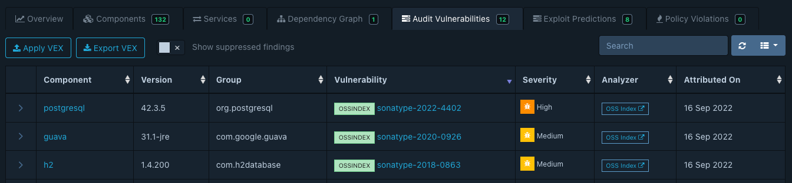

[Sonatype OSS Index] provides transparent and highly accurate results for components with valid Package URLs. 
The majority of vulnerabilities identified by OSS Index directly map to CVEs in the National Vulnerability Database (NVD).
However, OSS Index additionally includes Sonatype's proprietary vulnerability intelligence data, for which CVEs may
not exist.

Dependency-Track integrates with OSS Index using its [public API]. Dependency-Track does not mirror OSS Index entirely,
but it does consume vulnerabilities on a 'as-identified' basis.

The OSS Index integration is enabled by default.

#### Important Update (Sep 2025)

> Unauthenticated usage of OSS Index will be no longer supported.  
An API Token will be required.

### Authentication

1. [Sign In] or [Sign Up] for free. 
2. Get the API Token from your [Settings](https://ossindex.sonatype.org/user/settings).
3. Configure the API Token in Dependency-Track's administration panel.

Vulnerabilities from the proprietary dataset have their IDs prefixed with `sonatype-`, and their source labeled as `OSSINDEX`.

### May 2022 Update

Previously, authentication was only required for an extended rate limiting budget. Up to this point, vulnerabilities in
the OSS Index dataset that did not map to CVEs were identified by random UUIDs (e.g. `ae0cc4d7-fafe-4970-87e3-f8956039645a`).

In May 2022, Sonatype announced major changes to OSS Index.
Beside improvements in data quality and update frequencies, vulnerability IDs changed from random UUIDs to
a more CVE-like structure (e.g. `sonatype-2022-4402`).

Dependency-Track users who had OSS Index enabled before May 2022 may still have vulnerabilities with the old
naming scheme in their portfolio.

[Sonatype OSS Index]: https://ossindex.sonatype.org/
[public API]: https://ossindex.sonatype.org/doc/rest
[Sign In]: https://ossindex.sonatype.org/user/signin
[Sign Up]: https://ossindex.sonatype.org/user/register