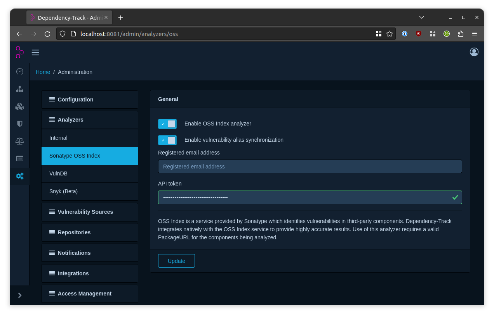

[Sonatype OSS Index] provides transparent and highly accurate results for components with valid Package URLs. 
The majority of vulnerabilities identified by OSS Index directly map to CVEs in the National Vulnerability Database (NVD).
However, OSS Index additionally includes Sonatype's proprietary vulnerability intelligence data, for which CVEs may
not exist.

Dependency-Track integrates with OSS Index using its [public API]. Dependency-Track does not mirror OSS Index entirely,
but it does consume vulnerabilities on a 'as-identified' basis.

The OSS Index integration is enabled by default.

#### Important Update (Sep 2025)

> Unauthenticated usage of OSS Index will be no longer supported. An API Token will be required.

### Authentication

1. [Sign In] or [Sign Up] for free. 
2. Get the API Token from your [Settings](https://ossindex.sonatype.org/user/settings).
3. Configure the API Token in Dependency-Track's administration panel.

Vulnerabilities from the proprietary dataset have their IDs prefixed with `sonatype-`, and their source labeled as `OSSINDEX`.

### Base URL Configuration

> **Migration Notice:**
> Sonatype is migrating OSS Index to a new API endpoint at `https://api.guide.sonatype.com`.
> Existing API tokens will continue to work with the new endpoint.
> The legacy endpoint will be deprecated in the future.

The base URL can be configured to use alternative API endpoints as they become available.

To configure the base URL, navigate to *Analyzers* → *Sonatype OSS Index* in the administration panel.

| Option   | Description                                          | Default                          |
|:---------|:-----------------------------------------------------|:---------------------------------|
| Base URL | Base URL of the OSS Index REST API                   | https://ossindex.sonatype.org    |

[Sonatype OSS Index]: https://ossindex.sonatype.org/
[public API]: https://ossindex.sonatype.org/doc/rest
[Sign In]: https://ossindex.sonatype.org/user/signin
[Sign Up]: https://ossindex.sonatype.org/user/register
