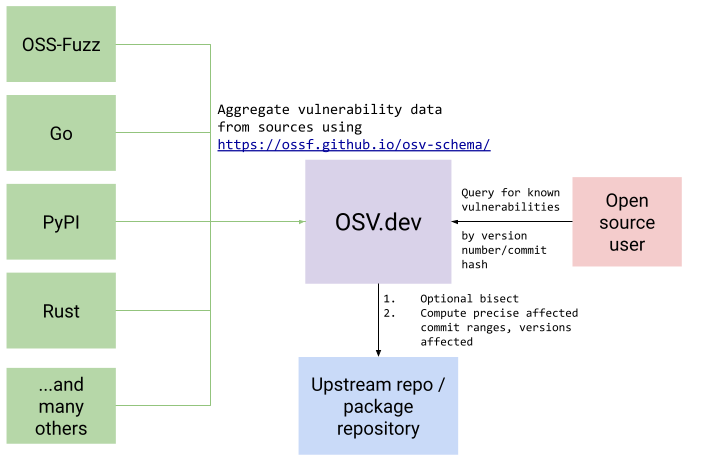

> **Notice**
>
> This is a preview feature only

[Open Source Vulnerabilities](https://osv.dev) (OSV) is a vulnerability database and triage infrastructure for open source projects aimed at helping both open source maintainers and consumers of open source.
This infrastructure serves as an aggregator of vulnerability databases that have adopted the [OpenSSF Vulnerability format](https://github.com/ossf/osv-schema).

OSV additionally provides infrastructure to ensure affected versions are accurately represented in each vulnerability entry, through bisection and version analysis.

Dependency-Track integrates with OSV by mirroring advisories from GCS bucket maintained by OSV [gs://osv-vulnerabilities.](https://osv-vulnerabilities.storage.googleapis.com/).
The mirror is refreshed daily, or upon restart of the Dependency-Track instance.
No personal access token is required to authenticate with OSV.

<i style="font-size:80%">OSV Architecture</i>
