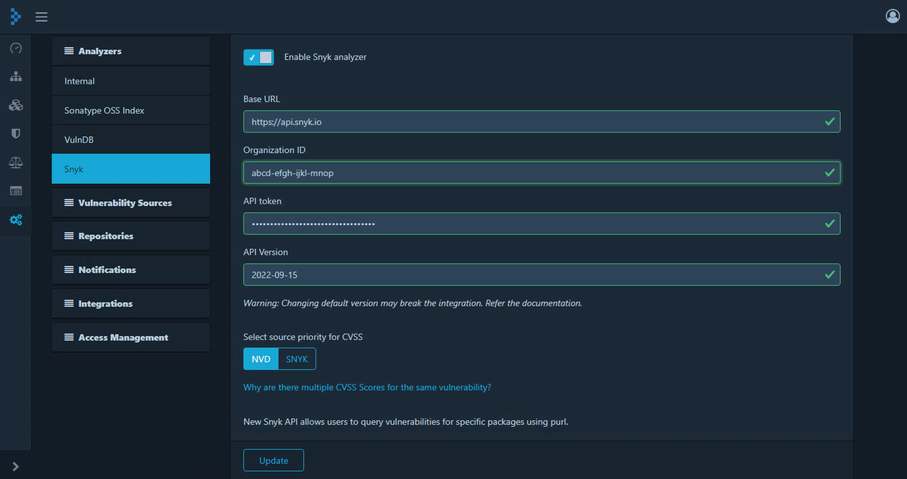

[Snyk](https://security.snyk.io) is a platform allowing you to scan, prioritize, and fix security vulnerabilities in your own code, open source dependencies, container images, and Infrastructure as Code (IaC) configurations.

It is a developer security platform. Integrating directly into development tools, workflows, and automation pipelines, Snyk makes it easy for teams to find, prioritize, and fix security vulnerabilities in code, dependencies, containers, and infrastructure as code. Supported by industry-leading application and security intelligence, Snyk puts security expertise in any developer's toolkit.

Dependency-Track integrates with Snyk using its [REST API](https://apidocs.snyk.io/). Dependency-Track does not mirror Snyk entirely,
but it does consume vulnerabilities on a 'as-identified' basis.

The Snyk integration is disabled by default.

### Authentication

User must get API token from Snyk. You can find your token in your [General Account Settings](https://snyk.io/account/) after you register with Snyk and log in. See [Authentication for API](https://docs.snyk.io/snyk-api-info/authentication-for-api).

Provide the token (**without** 'token' prefixed) in the configuration as shown below.

### Configuration

**Organization ID** can be set at in the [Settings](https://docs.snyk.io/products/snyk-code/cli-for-snyk-code/before-you-start-set-the-organization-for-the-cli-tests/finding-the-snyk-id-and-internal-name-of-an-organization) page of the Organization on the Web UI.

**Snyk base URL** is set by default, can be changed per requirement.

**Snyk API version** is set by default to latest version. It is updated every 6 months and might get expired causing API communication failure in which case it will be updated in next upcoming DT release. 
User can change it manually here. Please refer [API](https://apidocs.snyk.io/?version=2022-10-06#overview) to submit the correct version. 
**Number of threads for Snyk Analyzer to use** Snyk analyzer is implemented with multithreading model to complete the analysis faster. The number of threads that would be used is configurable. By default, it is set to 10. The value can be overridden by exporting this environment variable: `SNYK_THREAD_BATCH_SIZE`. The value can be set based on the configuration of the machine.  
To avoid running into rate limiting issues from the Snyk purl api server, the Snyk Analyzer currently makes use of client side rate limiting functionality. There are three configurable values for this:  
**Maximum number of requests allowed in a period of time** The mximum number of requests that the analyzer would make in a given period. This value is configurable by exporting the environment variable: `SNYK_LIMIT_FOR_PERIOD`. The default value for this is 1100 
**Timeout duration for a waiting thread** Currently the Snyk Analyzer is multithreaded. And each thread waits for the permission from the rate limiter. This is the maximum number of seconds the thread will wait before timing out. This property can be configured by exporting the environment variable: `SNYK_THREAD_TIMEOUT_DURATION`. The default value is 60 seconds. 
**Limit refresh period** The rate limiter would refresh the number of permissions available after every "limit refresh period". This value is in seconds and is configured with the environment variable: `SNYK_LIMIT_REFRESH_PERIOD`. The default value for this property is 60 seconds. 

### Understanding Snyk's CVSS analysis

The majority of vulnerabilities published by Snyk originate from proprietary research, public information sources, or through 3rd party disclosures.

When evaluating the severity of a vulnerability, it's important to note that there is no single CVSS vector - there are multiple CVSS vectors defined by multiple vendors, with the National Vulnerability Database (NVD) being one of them.

**NOTE:** For Beta version, user can select either from NVD or SNYK to prioritize the cvss vectors.