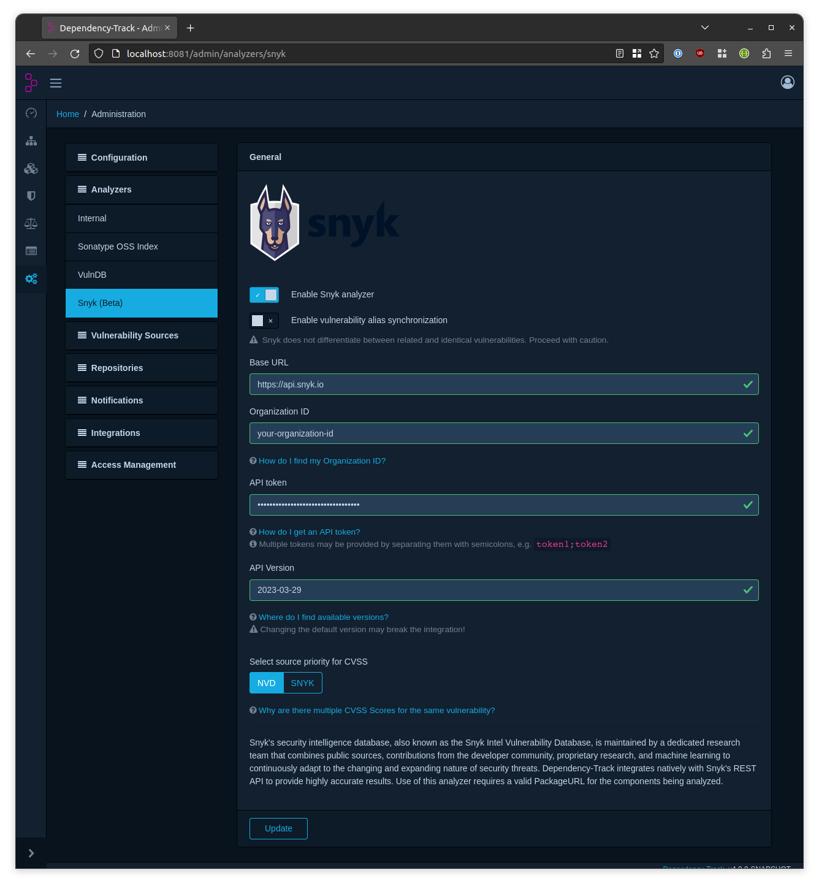

[Snyk](https://security.snyk.io) is a platform allowing you to scan, prioritize, and fix security vulnerabilities in your own code, open source dependencies, container images, and Infrastructure as Code (IaC) configurations.

It is a developer security platform. Integrating directly into development tools, workflows, and automation pipelines, Snyk makes it easy for teams to find, prioritize, and fix security vulnerabilities in code, dependencies, containers, and infrastructure as code. Supported by industry-leading application and security intelligence, Snyk puts security expertise in any developer's toolkit.

Dependency-Track integrates with Snyk using its [REST API](https://apidocs.snyk.io/). Dependency-Track does not mirror Snyk entirely,
but it does consume vulnerabilities on a 'as-identified' basis.

> Access to the Snyk REST API requires an enterprise [plan](https://snyk.io/plans/) subscription. API keys may be tested against Snyk's REST API using their [interactive API documentation](https://apidocs.snyk.io/?version=2023-06-22#auth).

The Snyk integration is disabled by default.

### Configuration

To configure the Snyk integration, navigate to *Analyzers* -> *Snyk (Beta)* in the administration panel.

|:---|:----|
| Base URL | Base URL of the Snyk REST API. Defaults to `https://api.snyk.io`. |
| Organization ID | The Snyk-internal organization ID.  Refer to [Finding the Snyk ID and internal name of an Organization] for details on how to find it. |
| API Token | Authentication token for the REST API.  Multiple tokens may be provided by separating them with semicolons (see [Using multiple Tokens](#using-multiple-tokens)).  Refer to [Authentication for API] for details on how to generate tokens. |
| API Version | Version of the Snyk REST API to use. |

### Vulnerability Aliases

As Snyk vulnerabilities have their own identifier format (e.g. `SNYK-JAVA-ORGECLIPSEJETTY-2945452`),
Snyk may additionally report identifiers of the same vulnerability in other databases, if applicable.

This makes it possible to correlate Snyk's vulnerabilities with CVEs in the NVD, or GHSAs in GitHub Security Advisories, 
for example. While oftentimes there will be a one-to-one relationship between Snyk vulnerability and CVEs or GHSAs,
Snyk does not guarantee that the reported identifiers actually refer to the same vulnerability. Additionally, it was
observed that:

* some Snyk vulnerabilities may refer to multiple CVEs, or multiple GHSAs
* multiple Snyk vulnerabilities may refer to the same CVEs and GHSAs

Alias support in Dependency-Track however is based on the assumption that vulnerabilities reported as aliases are indeed
identical. Given the data Snyk currently provides, it is not possible to guarantee that this assumption will hold true.

Thus, as of Dependency-Track v4.8.0, synchronization of alias information from Snyk (and other sources that provide it),
can be selectively turned off. For Snyk, synchronization is disabled per default. Enabling it is not recommended at this
point in time.

### Rate Limiting

The Snyk REST API is subject to rate limiting. At the time of writing, it allows for up to 1620 requests per minute, *per authentication token*.
These numbers may change over time, and Snyk does explicitly **not** consider changes to the quota to be breaking changes.
The current applicable rate limit can be found in Snyk's [REST API documentation].

Dependency-Track can deal with this limitation in multiple ways.

#### Retries

Rate limited requests are generally handled simply by retrying them, with an exponentially increasing delay between attempts.
Per default, requests will be retried up to 7 times, with delays between attempts increasing as follows:

| Retry Attempt | Delay before Attempt |
|:--------------|:---------------------|
| 1             | 1s                   |
| 2             | 2s                   |
| 3             | 4s                   |
| 4             | 8s                   |
| 5             | 16s                  |
| 6             | 32s                  |
| 7             | 60s                  |

This behavior works fine for the majority of users, but can be customized if desired. Refer to [Configuration] for details.
By monitoring metrics of this retry mechanism, it's possible to assess how often requests had to be retried (see [Monitoring]).
If requests have to be retried frequently, providing multiple authentication tokens (see below) can help.

#### Using multiple Tokens

In addition to retries, Dependency-Track can make use of multiple authentication tokens. When more than one token is
provided, token usage will be evenly distributed across requests in [round-robin](https://en.wikipedia.org/wiki/Round-robin_scheduling) fashion.
Using multiple tokens can improve throughput, as it becomes less likely that requests are rate limited and have to be retried.

To provide more than one token, simply concatenate the tokens with `;` (e.g. `token1;token2;token3`), 
and insert them in the *API Token* field of the configuration page as usual.

### Understanding Snyk's CVSS analysis

The majority of vulnerabilities published by Snyk originate from proprietary research, public information sources, or through 3rd party disclosures.

When evaluating the severity of a vulnerability, it's important to note that there is no single CVSS vector - there are multiple CVSS vectors defined by multiple vendors, with the National Vulnerability Database (NVD) being one of them.

**NOTE:** For Beta version, user can select either from NVD or SNYK to prioritize the cvss vectors.

[Authentication for API]: https://docs.snyk.io/snyk-api-info/authentication-for-api
[Configuration]: {{ site.baseurl }}
[Finding the Snyk ID and internal name of an Organization]: https://docs.snyk.io/products/snyk-code/cli-for-snyk-code/before-you-start-set-the-organization-for-the-cli-tests/finding-the-snyk-id-and-internal-name-of-an-organization
[Monitoring]: {{ site.baseurl }}#retries
[REST API documentation]: https://apidocs.snyk.io
