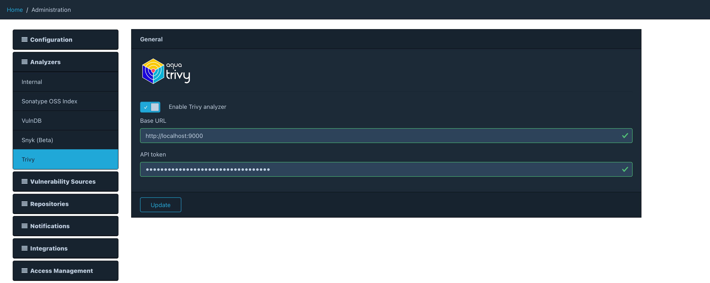

[Trivy](https://www.aquasec.com/products/trivy/) is a *comprehensive and versatile security scanner* by [Aqua Security],
supporting most popular programming languages, operating systems, and platforms. More details on scanning coverage
can be found in [Trivy's documentation](https://aquasecurity.github.io/trivy/latest/docs/coverage/).

Dependency-Track integrates with Trivy using its [client/server mode]. 

The Trivy integration requires an external Trivy server and is disabled by default.

### Configuration

To configure the Trivy integration, navigate to *Analyzers* -> *Trivy* in the administration panel.
The following options are available:

| Option         | Description                                                         | Default |
|:---------------|:--------------------------------------------------------------------|:--------|
| Enable         | Controls whether the Trivy integration is enabled                   | false   |
| Base URL       | Base URL of the Trivy REST API                                      | -       |
| API Token      | Authentication token for the REST API                               | -       | 
| Ignore Unfixed | Whether to ignore vulnerabilities for which no fix is available yet | false   |



### Running Trivy in Server Mode

To run Trivy in server mode, use the [server command]. For example:

```shell
trivy server \
  --listen :8080 \
  --token yourAuthToken
```

> **Note**  
> To prevent service disruption, you need to make sure that the Trivy server *keeps running*, and is automatically
> launched after the host system reboots.  
> The easiest way to achieve this is to run Trivy with Docker, and using an appropriate [restart policy].
> See below for an example with Docker Compose.

When deploying Dependency-Track via Docker Compose, Trivy can simply be added as yet another service in `docker-compose.yml`:

```yml
services:
  trivy:
    image: aquasec/trivy:latest
    command:
    - server
    - --listen
    - :8080
    - --token
    - yourAuthToken
    volumes:
    - "trivy-cache:/root/.cache/trivy"
    restart: unless-stopped
    
  # <Dependency-Track services here>

volumes:
  trivy-cache: {}
  # <Dependency-Track volumes here>
```

Deploying Trivy in the same Compose project allows you to specify `http://trivy:8080` as *base URL* in the Trivy configuration.  
Other deployment models will require you to configure the proper IP or hostname of the machine where Trivy is running.

### Known Limitations

* When scanning SBOMs, Trivy heavily relies on structures and properties that it populates when generating an SBOM.
This means that scanning SBOMs that were generated with tools other than Trivy may not yield as many results,
as when scanning an SBOM generated by Trivy itself.
* Trivy may report vulnerabilities from sources that Dependency-Track does not recognize. Because Trivy maintains
its own vulnerability database, it is inevitable that it deviates from Dependency-Track's. Vulnerabilities for which
this is the case will be labeled with source `UNKNOWN` in Dependency-Track.
* Vulnerability aliases can not be resolved for vulnerabilities of source `UNKNOWN`.
* Trivy may report vulnerabilities for which no official ID was assigned (yet). For example, the Debian project uses
[fake names] for certain vulnerabilities. Because Trivy integrates with Debian's vulnerability database directly,
it will report such vulnerabilities if applicable. The chance of encountering such vulnerabilities can be reduced by
enabling the *ignore unfixed vulnerabilities* option.

[Aqua Security]: https://www.aquasec.com/
[client/server mode]: https://aquasecurity.github.io/trivy/latest/docs/references/modes/client-server/
[fake names]: https://security-tracker.debian.org/tracker/data/fake-names
[restart policy]: https://docs.docker.com/config/containers/start-containers-automatically/#use-a-restart-policy
[server command]: https://github.com/aquasecurity/trivy/blob/v0.50.1/docs/docs/references/configuration/cli/trivy_server.md