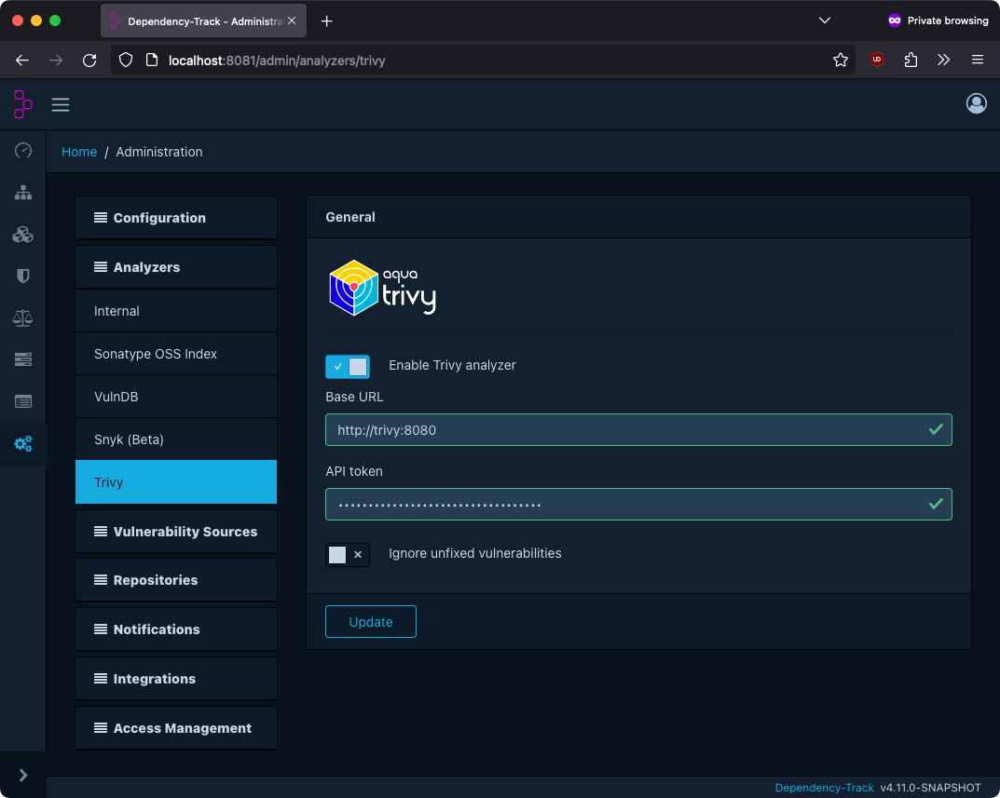

[Trivy](https://www.aquasec.com/products/trivy/) is a tool provided by aquas allowing you to scan for vulnerabilities.

Dependency-Track integrates with Trivy using its undocumented REST API.

The Trivy integration is disabled by default.

### Configuration

To configure the Trivy integration, navigate to *Analyzers* -> *Trivy* in the administration panel.

|:---|:----|
| Base URL | Base URL of the Trivy REST API. Defaults to `http://localhost:8081`. |
| API Token | Authentication token for the REST API. |

### Run Trivy as Server

Trivy can be runned as a [server](https://github.com/aquasecurity/trivy/blob/b5874e3ad38e77ac86eedd7a65785b2933f3685f/docs/docs/references/configuration/cli/trivy_server.md) by executing the command `trivy server --listen localhost:8081 --token dummy -d` or by setting it up on a container.
