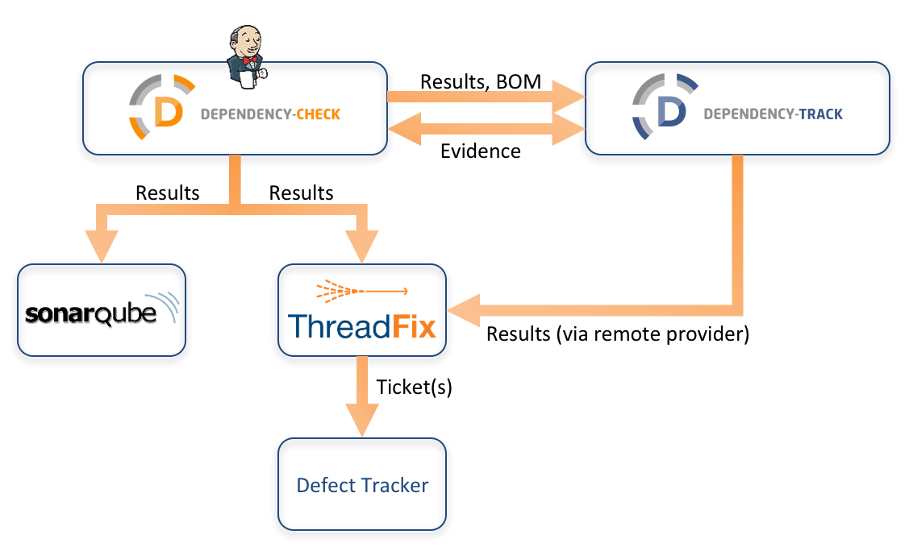

* Dependency-Check results can be published to SonarQube ([plugin](https://github.com/stevespringett/dependency-check-sonar-plugin))
* Dependency-Check results can be published to ThreadFix ([plugin](https://plugins.jenkins.io/threadfix))
* Dependency-Check results can be published to Dependency-Track
* Software bill-of-materials can be published to Dependency-Track
* Dependency-Check can use Dependency-Track as a source of evidence (coming soon)
* Dependency-Track results can be integrated into ThreadFix
