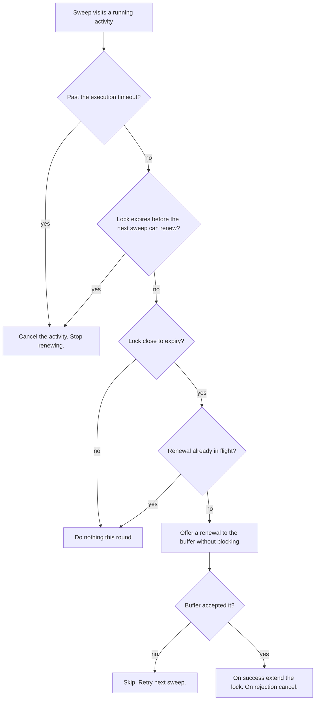

| Status   | Date       | Author(s)                              |
|:---------|:-----------|:---------------------------------------|
| Proposed | 2026-07-24 | [@nscuro](https://github.com/nscuro)   |

## Context

The durable execution engine (dex) runs units of work called activities. When a worker picks up an
activity task, it holds a lock on the task for a fixed lock timeout. While the lock is held, no other
worker may take the task. If the lock expires, the engine assumes the worker died and lets another
worker take over.

This breaks for activities that legitimately run longer than the lock timeout. The lock expires
mid-run, a second worker starts a duplicate, and the first worker can no longer complete its task.
The workflow then re-attempts every few minutes until an operator intervenes (see [issue 6795]).

The engine already has a heartbeat feature, but activity code must call it. The long-running work
often lives in domain code (for example the policy evaluator) that should not know the engine exists.
A separate change ([PR 6741]) adds a per-attempt execution timeout in the worker. That is a different concern,
a hard upper bound on one attempt. This ADR is about keeping the lock held during legitimate long work.

Two forces conflict:

- The lock timeout should be short, so a dead worker fails over fast.
- The activity should be free to run long.

### Possible Solutions

#### A: Raise the lock timeout per activity

Give slow activities a much longer lock timeout, sized to their worst case.
This is what the codebase already does for the vulnerability mirror activity.

*Pro*:

1. Trivial, no new code.

*Con*:

1. Must guess the worst case per activity, and a wrong guess brings the bug back.
2. A long timeout means slow failover when a worker dies.
3. Does not adapt to workloads that vary in size.

#### B: Automatic background heartbeat

The engine renews the lock on a schedule for every running activity.
Activities and domain code do nothing.

*Pro*:

1. Domain code stays clean.
2. Covers work blocked on I/O, and work inside one long transaction.
3. One renewal path, so automatic and manual renewal cannot fight each other.

*Con*:

1. The engine must handle the renewal path, lock-loss notification, and stuck activities with care.
2. Renewal is tied to a live thread, not to progress.

#### C: Manual heartbeat in the activity and domain code

Keep the current heartbeat method and call it from the long-running work.

*Pro*:

1. The lock is tied to real progress. A stalled activity loses its lock and is recovered.
2. Failure is simple to deliver, straight out of the call.

*Con*:

1. The engine concept leaks into domain code, which requires a heartbeat parameter and calls.
2. A missing call silently reintroduces the bug.

## Decision

We propose to follow solution **B**. The lock is renewed automatically in the engine.
Activities and domain code call no heartbeat method, and the manual heartbeat method is *removed*.

Structure:

- One heartbeat scheduler per engine instance, *not* per worker or per activity.
- A registry of running activities. A worker adds one before it runs and removes it after.
- A single sweep on a fixed short interval renews the locks close to expiry.

Two independent time limits govern an activity:

- **Lock timeout**: length of one lock, the amount added per renewal, and the failover delay after a worker dies.
  Short, usually a few minutes.
- **Execution timeout**: hard upper bound on one attempt, from [PR 6741].
  Long(-ish), at least the worst legitimate run.

The lock timeout must be smaller than the execution timeout. The engine checks this when an activity
is registered, and refuses to register an activity that has no execution timeout, or a lock timeout
equal to or larger than it. An invalid configuration fails fast at startup.

The heartbeat bridges the gap between the two, so a short lock can protect a long run.
Without it, an operator must make the lock timeout as long as the run, which is the cause of [issue 6795].

The sweep decides per activity, in order:

Further rules:

- Renewals use the engine's existing batching buffer. The scheduler never blocks on it. A full
  buffer means skip and retry. A buffer full for a whole lock means the database is unreachable, and
  the activity should lose its lock.
- On lock loss (rejected renewal or a passed local deadline), the engine cancels the activity via the
  same thread interrupt the execution timeout uses.
- A cancelled activity that ignores the interrupt cannot corrupt the task. Its completion is rejected
  by a version check on the lock, and the other worker owns the task. Note that this does *not* undo
  the side effects the cancelled run already performed. The engine already runs activities at least once,
  so activity effects must be safe to repeat.
- The execution timeout is the guard against an alive-but-stuck activity, whose lock would otherwise
  be renewed forever. This is why an execution timeout is required.
- The scheduler runs on a platform thread, so heavy activities cannot starve it.
- The lock timeout is configurable per activity under `dt.dex.engine.activity.<name>.lock-timeout-ms`,
  next to the execution timeout.

## Consequences

- Domain code stays clean and never learns about locks or heartbeats.
- Long activities keep their lock during legitimate work, fixing [issue 6795] for all three cases.
- Lock timeouts stay short, so failover stays fast while attempts may run long.
- One scheduler per instance keeps overhead low across many workers.
- Renewal is tied to a live thread, not to progress. A hung-but-alive activity holds its lock until
  the execution timeout. The timeout bounds this, and a stuck worker is easy to inspect.
- The heartbeat is a liveness optimization, not mutual exclusion. A lock can still be lost to a
  garbage collection pause or clock skew, so a duplicate run stays possible. Correctness rests on the
  version check at completion, not on the heartbeat. Because the engine already runs activities at
  least once, activity effects must be safe to repeat.
- The engine gains a scheduler thread, a shared registry, and a lock value read across threads. This
  stays inside the engine.

[ADR 002]: ./002-workflow-orchestration.md
[PR 6741]: https://github.com/DependencyTrack/dependency-track/pull/6741
[issue 6795]: https://github.com/DependencyTrack/dependency-track/issues/6795
