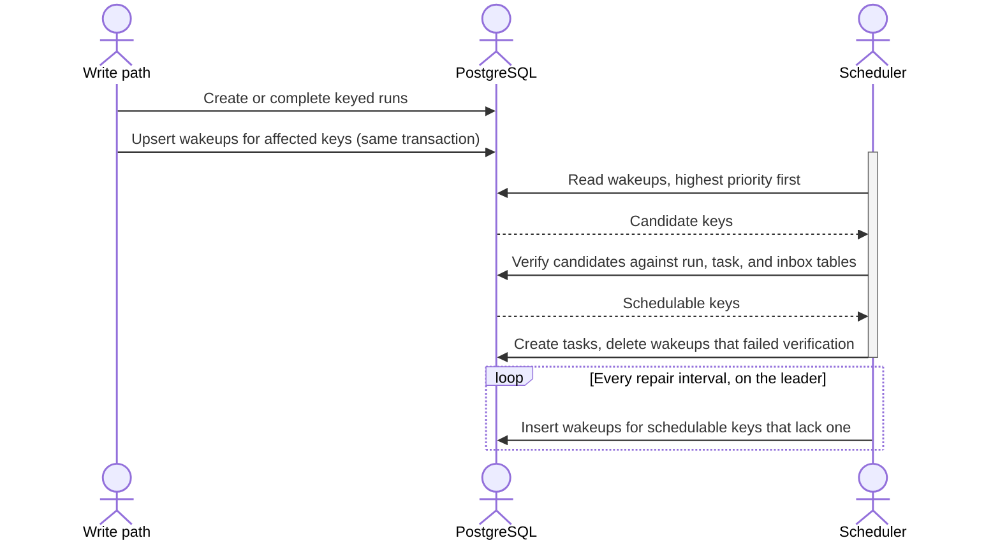

| Status   | Date       | Author(s)                            |
|:---------|:-----------|:-------------------------------------|
| Accepted | 2026-07-26 | [@nscuro](https://github.com/nscuro) |

## Context

Dependency-Track runs almost all of its background work as [dex] workflow runs,
and most of that work is per-project pipelines, for example:

* importing a BOM or VEX
* analyzing a project for vulnerabilities
* evaluating policies
* updating metrics

These pipelines must not run concurrently for the same project.
Two analyses of one project would race on its findings and metrics.

The engine expresses this with concurrency keys such as `import-bom:<project uuid>`,
where at most one run per key executes at a time. Per-project concurrency control was
a primary motivator for adopting workflow orchestration over queue-centric job chaining
in [ADR 002](./002-workflow-orchestration.md). Dependency-Track is the engine's only consumer,
and concurrency keys are the primitive its correctness leans on.

Keyed runs are therefore the bulk of all workflow traffic, and their volume is tied to
portfolio size. The scheduled portfolio analysis creates one keyed run per project in a
single burst, and every BOM upload adds more. A deployment with many projects routinely
holds a keyed backlog in the same order of magnitude as its project count.
Thus, >200k pending keyed runs have been observed in production.

The workflow task scheduler decides on every poll which keyed runs can be scheduled.
A key is schedulable when:

* its highest priority `CREATED` run has a visible message,
* no run holding the key is executing, and
* no task for the key is queued.

The scheduler derives this from the run, task, and inbox tables from scratch on each poll.

Deriving from scratch is robust. A wrong result lasts one poll, and no write path owes the
scheduler any bookkeeping. But each poll scans the whole keyed backlog,
so draining a backlog costs quadratic total work. Measured on HDD-class storage:

| Keyed backlog | Poll duration |
|--------------:|--------------:|
|          200k |        ~0.4 s |
|            1M |        ~1.8 s |
|            2M |        ~3.7 s |

Scheduling latency thus degrades exactly when the platform's core work happens:
while it drains a portfolio-wide burst.

Postgres-backed queue systems that met this problem at scale (e.g. [Solid Queue], [Hatchet],
[Oban Pro], [River Pro]) all converged on maintaining readiness state at write time instead
of deriving it at read time. All of them also made that state authoritative,
meaning dispatch trusts it without re-checking. Solid Queue and Oban Pro have a public
record of issues in this domain:

* A leaked slot wedges a key. A worker killed mid-execution leaves the semaphore held,
  and it is released only when its configured timeout expires ([solid-queue-546], [oban-pro-1.6.4]).
* A release race silently reduces concurrency. Solid Queue's blocked-execution query
  range-locks every row sharing a key, so a second worker concludes nothing is blocked
  and stops, running one worker where five were configured ([solid-queue-694], [oban-pro-0.12.2]).
* Enqueue contention aborts the caller's transaction. Two enqueues sharing a key collide on
  the semaphore's unique constraint, and the application sees `PG::InFailedSqlTransaction` ([solid-queue-224]).

### Possible Solutions

#### Keep deriving per poll, optimize further

**Pro:**

* No new state, no new failure modes, self-healing every poll.
* Already implemented and hardened against planner misbehavior.

**Con:**

* The remaining cost is the growth rate, not the constants.
  No further tuning changes the quadratic drain cost.

#### Materialize schedulability as run status

A run would carry a "parked" or "ready" state, maintained when runs are created, completed, or suspended.

**Pro:**

* Poll cost becomes independent of backlog size.

**Con:**

* Postgres offers no atomic arbitration for `UPDATE` under a unique index.
  Races between run creation and run completion on the same key abort entire write batches.
* Wrong materialized state changes scheduling behavior until it is repaired.
  The surveyed systems took this path, and their production bugs live here.

#### Per-key advisory locks

**Pro:**

* No schema changes.

**Con:**

* A key is held across transactions, processes, and suspensions that can last days.
  Advisory lock lifetimes cannot represent that.

#### Advisory wakeup hints

Writers record which keys recently had an event that could make them schedulable. The
scheduler only inspects hinted keys, and verifies each against the source-of-truth tables
before admitting anything.

**Pro:**

* Poll cost becomes proportional to queue capacity instead of backlog size.
* Hints carry no authority. A wrong hint cannot cause a wrong admission,
  only a wasted index probe.

**Con:**

* A missing hint stalls a key until a periodic repair pass restores it.
  Every write path that can make a key schedulable must remember to leave a hint.

## Decision

We will implement advisory wakeup hints, called *concurrency key wakeups*.

### Schema

A new `dex_workflow_concurrency_key_wakeup` table holds one row per queue and concurrency
key that recently had a relevant event:

| Column            | Type          | Key |
|:------------------|:--------------|:----|
| `queue_name`      | `text`        | PK  |
| `concurrency_key` | `text`        | PK  |
| `priority`        | `smallint`    |     |
| `version`         | `bigint`      |     |
| `freed`           | `boolean`     |     |
| `created_at`      | `timestamptz` |     |

* `priority` is the priority of the key's highest `CREATED` run at the time the wakeup was written.
  It can only overstate the current winner afterwards, which costs a wasted inspection, never a wrong one.
* `version` is bumped by every upsert. It guards wakeup deletion against a concurrent refresh.
* `freed` marks keys freed by workflow run termination, which signals an in-flight serialized chain.
* `created_at` is set on first insert only and orders same-priority wakeups by arrival.

The table is [`UNLOGGED`] because it is derived state that can be rebuilt at any time.

### Writing wakeups

Creating a keyed run leaves a wakeup for its key. Terminating a keyed run leaves one as
well, because termination frees the key for its next contender. Wakeups are written in the
same transaction as the state change that caused them, and a wakeup write can never abort
that transaction. This rules out the enqueue-time failures seen in the surveyed systems.

The wakeup table is the engine's only shared-write table. Everywhere else, each row has
exactly one writer, which makes the engine's write paths deadlock free by construction.
Advisory scheduling state cannot follow that rule, because creators, completers,
and the scheduler all mutate the same rows. However, all writes are single-statement upserts,
and all writers process keys in the same order, so the shared table stays deadlock free as well.

### Consuming wakeups

On each poll, the scheduler reads a bounded batch of wakeups: highest priority first,
then freed keys before first-time wakeups, then arrival order. Every key is verified against
the run, task, and inbox tables before anything is admitted. Only wakeups whose key failed
verification are consumed. Wakeups of schedulable keys survive until their key is actually
scheduled, so no admission is lost to capacity contention. The one-run-per-key invariant
itself stays enforced by the unique index on executing runs, independent of any wakeup state.

### Repair

A repair pass periodically re-derives schedulable keys from the source-of-truth tables,
on the leader only, and inserts wakeups that are missing. It bounds the damage of the design's
new failure mode, i.e. a lost or never-written wakeup stalls its key for at most one repair
interval (60 seconds by default). The same pass rebuilds the table after a crash truncated it.
On gaining leadership, a bounded, priority-first pass runs immediately, so scheduling resumes
within seconds while subsequent passes complete the rebuild.

Outside of crash recovery, a nonzero repair count means a write path failed to leave a
wakeup. The count is exposed as a metric and logged as a warning. The pass detects a reset
table even when the engine survived the database restart, so a crash rebuild is not
misreported as repairs.

### Standing constraints

The decision rests on four properties of the current engine:

* The scheduler is a cluster-wide singleton, so verification only races against writers
  and never against another scheduler.
* Concurrency semantics are single-run-per-key, so verification is a single probe rather
  than a counted check (as would be the case for semaphores).
* The unique executing index backs the one-run-per-key invariant independently.
* No keyed `CREATED` run becomes schedulable through the passage of time alone. Inbox messages
  can be made visible in the future, but only a workflow's own timer creates one, addressed to
  itself while it runs. Such runs are `RUNNING` or `SUSPENDED`, and that arm is derived per poll
  rather than from wakeups. A keyed run in `CREATED` always already has a visible message.

If the scheduler is ever sharded, counted concurrency limits are introduced,
or delayed run starts are added, this decision must be revisited.

## Consequences

Poll cost for the keyed arm becomes proportional to queue capacity instead of backlog size.
At a backlog of 2M keyed `CREATED` runs, one poll drops from 3.7 seconds to around 100
milliseconds. Mixed workloads see less, because the arm that scans executing runs is
unaffected by this change. Draining a burst becomes linear instead of quadratic work.
The derivation query lives on in the repair pass.

Schedulability knowledge spreads from one query to two write paths plus the repair pass.
A missed wakeup site stalls affected keys for up to one repair interval. This bug class did
not exist before, and the repair metric exists to surface it. No runtime fallback to the
previous derivation ships. An open source release loop cannot be relied on for timely
feedback, so the wakeup bookkeeping of every key state transition that needs one (creation,
completion, cancellation, continue-as-new, child workflows) is covered by tests instead.
Suspension needs no wakeup: a suspended run keeps holding its key, and its resumption is
scheduled from the per-poll arm.

Cross-key ordering changes from strict priority and arrival order to a close approximation.
Winner selection per key stays exact because it is re-derived on admission. Within the same
priority, keys freed by a completion are inspected before first-time arrivals, so
serialized chains keep flowing through creation floods. All other keys follow in strict
arrival order, so no key can be starved by newer arrivals.

A repair pass costs about a second per million pending keys, per queue, in steady state.
Rebuilding a multi-million key backlog after a crash can take tens of seconds.

The wakeup table adds roughly two upserts per keyed run lifecycle. During mass creation it
grows to one row per distinct pending key, around 400 MB at 2M keys with typical key
lengths. It is `UNLOGGED`, aggressively autovacuumed, and drains through consumption.

[Hatchet]: https://github.com/hatchet-dev/hatchet
[Oban Pro]: https://oban.pro/
[River Pro]: https://riverqueue.com/pro
[Solid Queue]: https://github.com/rails/solid_queue
[`UNLOGGED`]: https://www.postgresql.org/docs/current/sql-createtable.html#SQL-CREATETABLE-UNLOGGED
[dex]: ../../dex
[oban-pro-0.12.2]: https://oban.pro/docs/pro/0.12.2/changelog.html
[oban-pro-1.6.4]: https://oban.pro/docs/pro/1.6.9/changelog.html
[solid-queue-224]: https://github.com/rails/solid_queue/issues/224
[solid-queue-546]: https://github.com/rails/solid_queue/issues/546
[solid-queue-694]: https://github.com/rails/solid_queue/issues/694
