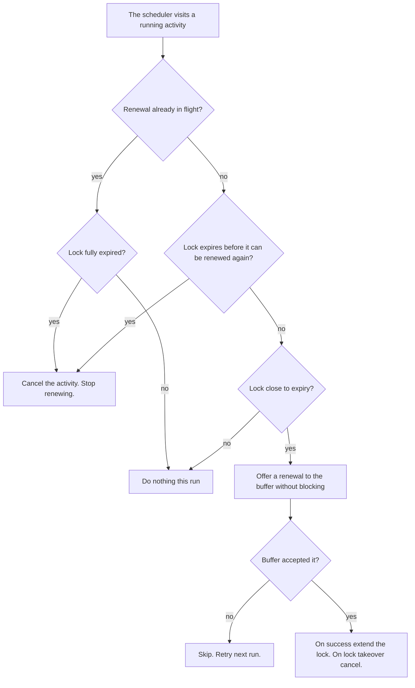

| Status   | Date       | Author(s)                            |
|:---------|:-----------|:-------------------------------------|
| Accepted | 2026-07-24 | [@nscuro](https://github.com/nscuro) |

## Context

The durable execution engine (dex) runs units of work called activities. When a worker picks up an
activity task, it holds a lock on the task for a fixed lock timeout. While the lock is held, no other
worker may take the task. If the lock expires, the engine assumes the worker died and lets another
worker take over.

This breaks for activities that legitimately run longer than the lock timeout. The lock expires
mid-run, a second worker starts a duplicate, and the first worker can no longer complete its task.
The workflow then re-attempts every few minutes until an operator intervenes (see [issue 6795]).

The engine already has a heartbeat feature, but activity code must call it. The long-running work
often lives in domain code (for example the policy evaluator) that should not know the engine exists.
A separate change ([PR 6741]) added a per-attempt execution timeout in the worker. That is a different concern,
a hard upper bound on one attempt. This ADR is about keeping the lock held during legitimate long work.

Two forces conflict:

- The lock timeout should be short, so a dead worker fails over fast.
- The activity should be free to run long.

> [!NOTE]
> Correctness does not depend on the lock. A worker may only commit an activity's result if it still
> holds the lock version it started with. If it lost the lock, its completion is rejected, and the
> worker that took the task over owns it. Detecting a dead worker is always timing-based, so a lock
> can be lost to a garbage collection pause or clock skew. Such a loss results at most in a duplicate execution,
> never a duplicate commit. The engine already runs activities at least once, so their effects must be
> safe to repeat. Everything below only reduces wasted duplicate runs. The heartbeat is a liveness
> optimization, not mutual exclusion.

### Possible Solutions

#### A: Raise the lock timeout per activity

Give slow activities a much longer lock timeout, sized to their worst case.
This is what the codebase already does for the vulnerability mirror activity.

*Pro*:

1. Trivial, no new code.

*Con*:

1. Must guess the worst case per activity, and a wrong guess brings the bug back.
2. A long timeout means slow failover when a worker dies.
3. Does not adapt to workloads that vary in size.

#### B: Automatic background heartbeat

The engine renews the lock on a schedule for every running activity.
Activities and domain code do nothing.

*Pro*:

1. Domain code stays clean.
2. Covers work blocked on I/O, and work inside one long transaction.
3. One renewal path, so automatic and manual renewal cannot fight each other.

*Con*:

1. The engine must handle the renewal path, lock-loss notification, and stuck activities with care.
2. Renewal is tied to a live thread, not to progress.

#### C: Manual heartbeat in the activity and domain code

Keep the current heartbeat method and call it from the long-running work.

*Pro*:

1. The lock is tied to real progress. A stalled activity loses its lock and is recovered.
2. Failure is simple to deliver, straight out of the call.

*Con*:

1. The engine concept leaks into domain code, which requires a heartbeat parameter and calls.
2. A missing call silently reintroduces the bug.

## Decision

We propose to follow solution **B**. The lock is renewed automatically in the engine.
Activities and domain code call no heartbeat method, and the manual heartbeat method is *removed*.

Structure:

- One heartbeat scheduler per engine instance, *not* per worker or per activity.
- A registry of running activities. A worker adds one before it runs and removes it after.
- On a fixed short interval the scheduler renews the locks that are close to expiry.

Two independent time limits govern an activity:

- **Lock timeout**: length of one lock, the length a renewal sets it to, and the failover delay after a worker dies.
  Renewals set the lock to *now* plus this value rather than extending the previous expiry,
  so the failover delay is the lock timeout and not some multiple of it.
- **Execution timeout**: hard upper bound on one attempt. At least the worst legitimate run.

Both limits have an engine-wide default, applied to activities registered without an explicit value,
so neither can be forgotten. Locks default to five minutes and executions to one hour,
configurable via `dt.dex-engine.activity.lock-timeout-ms` and `dt.dex-engine.activity.execution-timeout-ms`.
Individual activities may deviate from the execution default via `dt.dex-engine.activity.<name>.execution-timeout-ms`.

The lock timeout is usually much smaller than the execution timeout, and the heartbeat covers the
time in between. The engine does not require this, because both orders are safe. If the lock is
shorter than the attempt, renewal keeps it alive until the attempt ends. If the lock is longer than
the execution timeout, it is never renewed, because the attempt is cancelled before that. The
second case is not wrong, it only makes failover slower than it has to be.

Without the heartbeat, the lock timeout must be as long as the run itself, which is what causes [issue 6795].

On each run, the scheduler decides per activity, in order:

The execution timeout is *not* part of this decision. It is enforced by the worker, which cancels
the activity when a single attempt runs longer than it (see [PR 6741]). The scheduler only renews
the lock and reacts to its loss.

Further rules:

- Renewals use the engine's existing batching buffer. The scheduler never blocks on it. A full
  buffer means skip and retry. A buffer full for a whole lock means the database is unreachable, and
  the activity should lose its lock.
- The engine refuses to start when a lock timeout leaves no scheduler run between the start of its
  renewal window and its give-up deadline, because such a lock would be given up on before a renewal
  is ever attempted. With the margins below, that floor is nine times the heartbeat interval.
- When an activity finishes, the worker waits for an in-flight renewal to complete before completing
  the task. Otherwise the renewal could bump the lock version behind the completion's back,
  and the engine would discard its own finished work as a lost lock.
- On lock loss (rejected renewal or a passed local deadline), the engine cancels the activity via the
  same thread interrupt the execution timeout uses.
- A cancelled activity that ignores the interrupt cannot corrupt the task, see [Context](#context).
  It does, however, keep performing side effects that the other worker performs again.
  The engine already runs activities at least once, so activity effects must be safe to repeat.
- The execution timeout guards against an alive-but-stuck activity, whose lock would otherwise be
  renewed forever. This is why every activity has one.
- The scheduler runs on a platform thread, so heavy activities cannot starve it.
- Because renewal decouples the lock from the length of a run, the same default applies to all
  activities, and an activity only deviates for a documented reason. Operators tune the default
  rather than individual activities, since the value expresses how quickly the work of a dead node
  is picked up, not how long any single workload may take.
- The heartbeat interval is engine configuration, not a deployment property. It is meaningful only
  in relation to the lock timeout it renews, and exposing both invites combinations the engine
  refuses to start with.

## Consequences

- Domain code stays clean and never learns about locks or heartbeats.
- Long activities keep their lock during legitimate work, fixing [issue 6795].
- Lock timeouts stay short, so failover stays fast while attempts may run long. The previous
  timeouts were sized for a world without heartbeats and ranged from one to thirty minutes.
  Failover after a worker dies therefore improves for portfolio-wide activities, and degrades
  for the short ones.
- One scheduler per instance keeps overhead low across many workers.
- A hung-but-alive activity holds its lock until the execution timeout.
- A lock can still be lost to a garbage collection pause or clock skew, so duplicate executions remain possible.
- The engine gains a scheduler thread, a shared registry, and a lock value read across threads.

[PR 6741]: https://github.com/DependencyTrack/dependency-track/pull/6741
[issue 6795]: https://github.com/DependencyTrack/dependency-track/issues/6795
