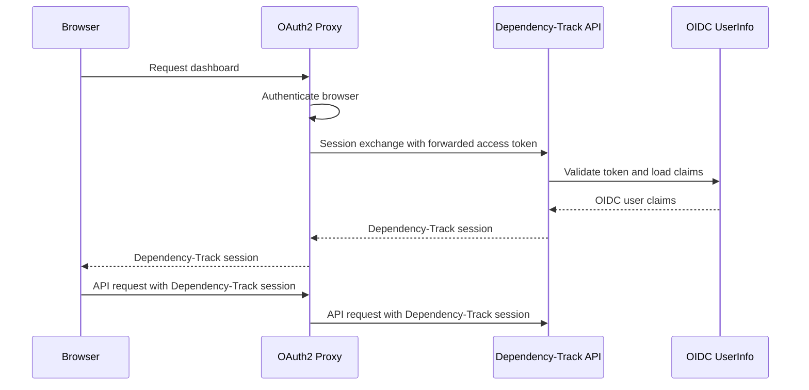

| Status   | Date       | Author(s)                          |
|:---------|:-----------|:-----------------------------------|
| Proposed | 2026-08-28 | [@jjj-n](https://github.com/jjj-n) |

## Context

Dependency-Track supports local, LDAP, and OpenID Connect (OIDC) login. For OIDC login, the
frontend starts the authorization flow and sends the resulting tokens to the API server. The API
server validates the tokens, creates or finds an OIDC user, and returns a Dependency-Track
session.

Some deployments put [OAuth2 Proxy] in front of every application. OAuth2 Proxy authenticates
the browser before a request reaches the application. When it uses an OIDC provider, it can pass
the access token or ID token to the upstream application. Starting another OIDC flow in the
Dependency-Track frontend gives the user a second login step.

OAuth2 Proxy can also pass the authenticated username, email, and groups in HTTP headers. These
identity headers are not signed. A client can forge them if it can bypass the proxy, or if the
proxy preserves values supplied by the client. Accepting them as credentials would make the
deployment network part of the authentication mechanism.

The frontend and REST API use a Dependency-Track bearer session after login. Passing an OIDC ID
token to the upstream in the `Authorization` header conflicts with this session because both use
the same header. The browser also cannot read a header that the proxy adds to its request. A
server-side exchange is therefore required even when the existing OIDC validation is reused.

This decision addresses interactive users opening the Dependency-Track dashboard. Authentication
for service and robot accounts is tracked separately in [issue 7055] and [issue 7056].

### Possible Solutions

#### Exchange trusted identity headers for a Dependency-Track session

The frontend can call a session exchange endpoint. The endpoint can trust identity headers added
by OAuth2 Proxy, then create or find a dedicated proxy user.

This works with non-OIDC providers. However, it requires strict network isolation or another way
to authenticate the proxy. It also introduces another user type and duplicates existing OIDC
user provisioning and team synchronization behavior.

#### Validate an access token forwarded by OAuth2 Proxy

OAuth2 Proxy can pass the provider access token in the `X-Forwarded-Access-Token` header. The API
server can use the existing OIDC UserInfo validation, user provisioning, team synchronization,
and session creation behavior.

This does not trust plain identity headers and does not require another user type. OAuth2 Proxy's
existing client registration can be reused. However, the provider must support OIDC, and the API
server must be able to access OIDC discovery and the UserInfo endpoint.

#### Validate an ID token forwarded by OAuth2 Proxy

The API server can validate a forwarded ID token with the existing OIDC issuer, audience, and
signature checks. This avoids a UserInfo request when the token contains all required claims.

OAuth2 Proxy's stable direct-upstream option sends the ID token in the `Authorization` header.
This would overwrite the Dependency-Track session on later requests. A separate header requires
structured OAuth2 Proxy configuration or an additional reverse proxy. Access token refresh also
does not guarantee that the stored ID token is replaced. This makes the option less portable for
the first version.

#### Authenticate every API request from proxy headers

The API server can treat proxy headers as credentials on every request. This avoids a session
exchange.

This conflicts with the existing frontend session flow. It also mixes proxy identity, API keys,
and session bearer tokens in the common authentication path. Logout and direct API access become
harder to define.

## Decision

We will validate an access token forwarded by OAuth2 Proxy and exchange it for a normal
Dependency-Track session. The integration will only support OAuth2 Proxy deployments backed by
an OIDC provider. It will only authenticate interactive users.

The API server will extend the version 1 login API with a session exchange endpoint. The endpoint
will read the access token from `X-Forwarded-Access-Token`. It will not accept a token from the
request body. It will pass the token to the existing OIDC authentication path and issue the same
short-lived bearer session used by other login methods.

The API server must have OIDC enabled and configured for the same issuer used by OAuth2 Proxy.
Existing username claim, user provisioning, default team, and team synchronization settings will
apply. The frontend OIDC client settings can remain empty because the frontend will not start an
OIDC flow for this integration.

Users authenticated through the exchange will be normal OIDC users. No proxy-specific user type,
database discriminator, migration, or access management API will be added.

The frontend will attempt the exchange when it has no Dependency-Track session, before it displays
the login choices. A successful exchange will run the existing permission check and open the
requested page. A response indicating that no forwarded access token is available will continue
to the existing local, LDAP, or OIDC login options.

Operators must configure OAuth2 Proxy to replace `X-Forwarded-Access-Token` values supplied by
clients. In direct-upstream mode, this is provided by `--pass-access-token`, as described in the
[OAuth2 Proxy header options]. In NGINX `auth_request` mode, OAuth2 Proxy must use both
`--pass-access-token` and `--set-xauthrequest`. NGINX must then copy the token from the
authentication response into the expected upstream header, as shown in the
[OAuth2 Proxy NGINX integration]. Operators must also prevent clients from bypassing OAuth2
Proxy. Dependency-Track will not use forwarded username or email headers as credentials.

The forwarded provider token will not use the `Authorization` header. That header remains
available for the Dependency-Track session after the exchange.

API keys remain a Dependency-Track authentication method, but this decision does not define how
machine clients authenticate to OAuth2 Proxy. Deployments that require gateway authentication for
machine traffic must address it separately. The session exchange will not accept API keys as
proxy credentials.

## Consequences

* Users authenticated by OAuth2 Proxy can open the dashboard without a second login action.
* The API server reuses its OIDC users, provisioning, team synchronization, permissions, and
  sessions. No new user type or database migration is required.
* The integration only works when OAuth2 Proxy uses an OIDC provider and forwards an access token
  that the provider accepts at its UserInfo endpoint.
* The API server needs network access to OIDC discovery and UserInfo. This may not meet deployment
  policies that prohibit applications from contacting the identity provider.
* The access token crosses the proxy-to-API boundary. Both components must use a protected network
  path, and neither component may log the token.
* OAuth2 Proxy must refresh its access token before it expires. NGINX `auth_request` deployments
  must also return refreshed session cookies to the browser.
* Existing API key validation is unchanged, but OAuth2 Proxy may reject machine requests before
  they reach the API server. Service account and workload identity support remain separate work.
* The API server and frontend changes must be released together for automatic login. Older
  frontends will continue to show the normal login page.
* Logging out of Dependency-Track only deletes the local session. If the OAuth2 Proxy session is
  still active, opening the login page can create a new local session. A gateway-wide logout flow
  is outside the scope of this decision.

[OAuth2 Proxy]: https://oauth2-proxy.github.io/oauth2-proxy/
[OAuth2 Proxy header options]: https://oauth2-proxy.github.io/oauth2-proxy/configuration/overview/#header-options
[OAuth2 Proxy NGINX integration]: https://oauth2-proxy.github.io/oauth2-proxy/configuration/integrations/nginx/
[issue 7055]: https://github.com/DependencyTrack/dependency-track/issues/7055
[issue 7056]: https://github.com/DependencyTrack/dependency-track/issues/7056
