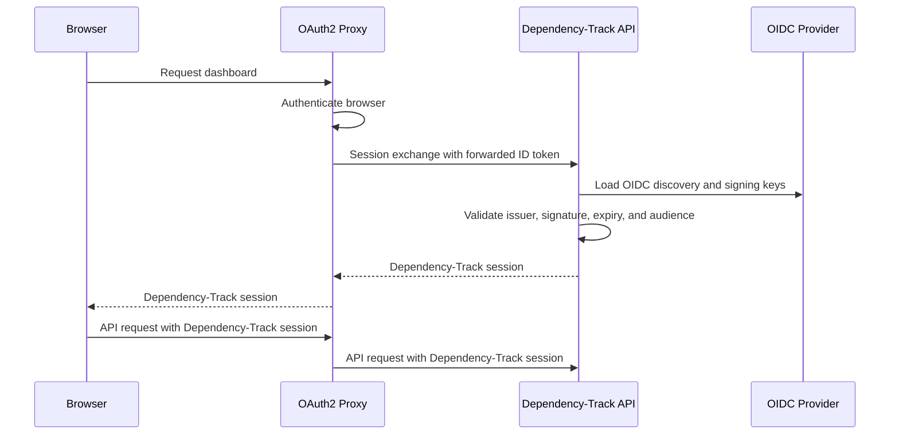

| Status   | Date       | Author(s)                          |
|:---------|:-----------|:-----------------------------------|
| Proposed | 2026-08-28 | [@jjj-n](https://github.com/jjj-n) |

## Context

Dependency-Track supports local, LDAP, and OpenID Connect (OIDC) login. For OIDC login, the
frontend starts the authorization flow and sends the resulting tokens to the API server. The API
server validates the tokens, creates or finds an OIDC user, and returns a Dependency-Track
session.

Some deployments put [OAuth2 Proxy] in front of every application. OAuth2 Proxy authenticates
the browser before a request reaches the application. These deployments use the proxy to apply
the same access policy to every application. Starting another OIDC flow in the Dependency-Track
frontend adds another redirect and makes the proxy session separate from the application login.

The existing Dependency-Track OIDC flow remains the default. It gives Dependency-Track its own
OIDC client and does not depend on a proxy credential. The integration in this decision is only
for deployments that require an OAuth2 Proxy session to initiate the application session.

OAuth2 Proxy can pass the authenticated username, email, and groups in HTTP headers. These
identity headers are not signed. A client can forge them if it can bypass the proxy, or if the
proxy preserves values supplied by the client. Accepting them as credentials would make the
deployment network the only authentication boundary.

OAuth2 Proxy can also pass the provider access token or ID token to the upstream application.
Calling the OIDC UserInfo endpoint proves that an access token is accepted by that endpoint. It
does not prove that the token was issued for Dependency-Track. An access token issued to another
client of the same identity provider could therefore be accepted by the existing UserInfo path.
Using an access token as a Dependency-Track credential would require resource server validation,
including a Dependency-Track audience. That is broader than reusing the existing OIDC login.

An OIDC ID token has the client identifier in its audience. Dependency-Track already validates
the ID token issuer, signature, expiration, and audience. The OAuth2 Proxy client identifier can
therefore be configured as the expected audience and used as a cryptographic boundary between
clients of the same identity provider.

The frontend and REST API use a Dependency-Track bearer session after login. OAuth2 Proxy's
stable direct-upstream option puts the ID token in the `Authorization` header. This conflicts
with the Dependency-Track session because both use the same header. The browser also cannot read
a header that the proxy adds to its request. A separate header and a server-side exchange are
therefore required.

This decision addresses interactive users opening the Dependency-Track dashboard. Authentication
for service and robot accounts is tracked separately in [issue 7055] and [issue 7056].

### Possible Solutions

#### Use native Dependency-Track OIDC behind OAuth2 Proxy

OAuth2 Proxy can authenticate the gateway request, then the frontend can start the existing
Dependency-Track OIDC authorization flow. An existing identity provider session can complete the
second flow without another credential prompt.

This keeps an independent application authentication boundary and uses only standard OIDC
behavior. It still requires a Dependency-Track browser flow, redirect URI, and client
configuration. It also does not use the OAuth2 Proxy session as the application login event.

#### Exchange trusted identity headers for a Dependency-Track session

The frontend can call a session exchange endpoint. The endpoint can trust identity headers added
by OAuth2 Proxy, then create or find a dedicated proxy user.

This works with non-OIDC providers. However, it requires strict network isolation or another way
to authenticate the proxy. It also introduces another user type and duplicates existing OIDC
user provisioning and team synchronization behavior.

#### Validate an access token forwarded by OAuth2 Proxy

OAuth2 Proxy can pass the provider access token in the `X-Forwarded-Access-Token` header. The API
server can call the existing OIDC UserInfo endpoint and reuse the returned user claims.

This does not prove that the access token is intended for Dependency-Track. Correct resource
server support must validate a Dependency-Track audience, signature, issuer, token type, and
expiration as described by the [OAuth 2.0 JWT access token profile]. It must also define scopes
for API authorization. These requirements apply to both human and machine clients and are
tracked separately.

#### Validate an ID token forwarded by OAuth2 Proxy

The API server can validate a forwarded ID token with the existing OIDC issuer, audience,
signature, and expiration checks. The audience binds the token to the separately configured
OAuth2 Proxy client instead of only trusting the network path. The resulting identity can reuse
the normal OIDC user, provisioning, team synchronization, and session behavior.

The ID token must use a separate header so it does not replace the Dependency-Track session in
`Authorization`. Direct-upstream deployments need OAuth2 Proxy's structured header injection.
NGINX `auth_request` deployments can remap the ID token from the authentication response. The ID
token must contain every claim required by the configured username and team synchronization
settings.

#### Authenticate every API request from proxy headers

The API server can treat proxy headers as credentials on every request. This avoids a session
exchange.

This conflicts with the existing frontend session flow. It also mixes proxy identity, API keys,
and session bearer tokens in the common authentication path. Logout and direct API access become
harder to define.

## Decision

We will validate an ID token forwarded by OAuth2 Proxy and exchange it for a normal
Dependency-Track session. The integration will only support OAuth2 Proxy deployments backed by
an OIDC provider. It will only authenticate interactive users.

The API server will extend the version 1 login API with a session exchange endpoint. The endpoint
will read a bearer ID token from `X-Forwarded-ID-Token`. It will not accept a token from the
request body. It will pass the token to the existing OIDC ID token validation path and issue the
same short-lived bearer session used by other login methods.

The ID token must pass the standard checks defined by [OpenID Connect Core] and already performed
by Dependency-Track. These include issuer, signature, expiration, and audience validation. A new
`dt.auth-proxy.client-id` setting must match the client identifier used by the reverse proxy that
forwards the ID token. It is the expected audience for the forwarded ID token. A token issued to
a different client of the same identity provider will be rejected.

The setting is named generically because the exchange validates a forwarded ID token and does not
depend on which reverse proxy provides it. OAuth2 Proxy is the reference implementation for the
first version: other reverse proxies that can inject a bearer ID token into
`X-Forwarded-ID-Token` should work with the same validation path, but only the OAuth2 Proxy
configuration is documented and validated.

Native Dependency-Track OIDC continues to use `dt.oidc.client-id`. The two login paths can be
enabled together and can use different client registrations, but both registrations must use the
provider configured by `dt.oidc.issuer`. This avoids requiring a public browser client and the
OAuth2 Proxy client to share a registration.

The first version will not authenticate from a forwarded access token and will not call UserInfo
during the exchange. The ID token must contain the subject, configured username claim, and the
configured teams claim when team synchronization is enabled. If a required claim is absent, the
exchange will fail rather than construct an incomplete profile or synchronize an empty team list.
An explicitly present empty teams claim remains valid and removes mapped team memberships.
Supporting providers that only return required claims from UserInfo is outside the first version.

Users authenticated through the exchange will be normal OIDC users. Existing user provisioning,
default team, team synchronization, and session settings will apply. No proxy-specific user type,
database discriminator, migration, or access management API will be added.

The frontend will attempt the exchange when it has no Dependency-Track session, before it displays
the login choices. A successful exchange will run the existing permission check and open the
requested page. A response indicating that no forwarded ID token is available will continue to
the existing local, LDAP, or OIDC login options.

OAuth2 Proxy must remove any `X-Forwarded-ID-Token` value supplied by a client and set its own
value. Direct-upstream deployments must use [OAuth2 Proxy structured configuration] with
`injectRequestHeaders`, the session `id_token` claim, and `preserveRequestValue: false`. The
header value must use the `Bearer` scheme. This structured configuration is currently an alpha
OAuth2 Proxy feature.

In [OAuth2 Proxy NGINX integration] using `auth_request`, OAuth2 Proxy can use
`--set-authorization-header` to return the ID token in the authentication response. NGINX must
copy that value to `X-Forwarded-ID-Token` for the Dependency-Track upstream and must replace any
client value. The stable direct-upstream `--pass-authorization-header` option documented under
[OAuth2 Proxy header options] is not supported because it would replace the Dependency-Track
session in `Authorization` on every request.

Operators must still prevent clients from bypassing OAuth2 Proxy. This preserves gateway access
policy and prevents unauthenticated requests from reaching the application. Identity integrity
does not rely only on that network rule because Dependency-Track also validates the forwarded ID
token. Dependency-Track will not use forwarded username, email, or group headers as credentials.

API keys remain a Dependency-Track authentication method, but this decision does not define how
machine clients authenticate to OAuth2 Proxy. Deployments that require OAuth 2.0 access tokens
for machine traffic need native resource server support. That work remains separate.

## Consequences

* Users authenticated by OAuth2 Proxy can open the dashboard without starting a second OIDC flow.
* The API server reuses its OIDC users, provisioning, team synchronization, permissions, and
  sessions. No new user type or database migration is required.
* Dependency-Track validates the ID token issuer, signature, expiration, and audience. A plain
  forwarded identity header or an access token for another client is not sufficient to log in.
* OAuth2 Proxy and native Dependency-Track OIDC have separate client identifier settings and may
  use different client registrations with the same issuer.
* Every claim required for the Dependency-Track OIDC profile must be present in the ID token.
  A missing required claim fails the exchange. Providers that only expose those claims through
  UserInfo are not supported by the first version.
* The API server needs network access to OIDC discovery and signing keys. It does not need to call
  UserInfo during a proxy session exchange.
* Direct-upstream deployments depend on OAuth2 Proxy's alpha structured header configuration.
  NGINX `auth_request` deployments require explicit header remapping.
* The ID token crosses the proxy-to-API boundary. Both components must use a protected network
  path, and neither component may log the token.
* OAuth2 Proxy must provide an unexpired ID token whenever a new Dependency-Track session is
  needed. If OAuth2 Proxy does not refresh the stored ID token, the user must authenticate with
  the proxy again after it expires.
* Existing API key validation is unchanged, but OAuth2 Proxy may reject machine requests before
  they reach the API server. Service account and workload identity support remain separate work.
* The API server and frontend changes must be released together for automatic login. Older
  frontends will continue to show the normal login page.
* Logging out of Dependency-Track only deletes the local session. If the OAuth2 Proxy session is
  still active and has a valid ID token, opening the login page can create a new local session. A
  gateway-wide logout flow is outside the scope of this decision.

[OAuth2 Proxy]: https://oauth2-proxy.github.io/oauth2-proxy/
[OAuth2 Proxy header options]: https://oauth2-proxy.github.io/oauth2-proxy/configuration/overview/#header-options
[OAuth2 Proxy structured configuration]: https://oauth2-proxy.github.io/oauth2-proxy/configuration/alpha-config/
[OAuth2 Proxy NGINX integration]: https://oauth2-proxy.github.io/oauth2-proxy/configuration/integrations/nginx/
[OpenID Connect Core]: https://openid.net/specs/openid-connect-core-1_0.html
[OAuth 2.0 JWT access token profile]: https://www.rfc-editor.org/rfc/rfc9068.html
[issue 7055]: https://github.com/DependencyTrack/dependency-track/issues/7055
[issue 7056]: https://github.com/DependencyTrack/dependency-track/issues/7056
