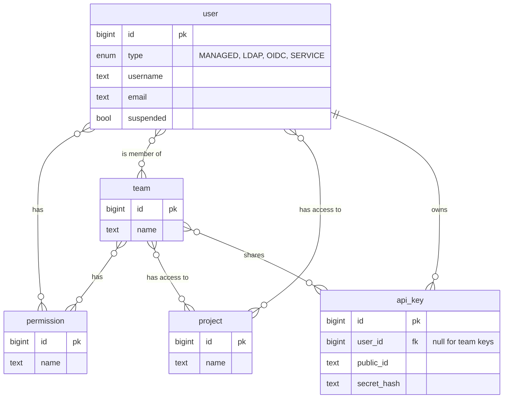

| Status   | Date       | Author(s)                            |
|:---------|:-----------|:-------------------------------------|
| Accepted | 2026-09-10 | [@nscuro](https://github.com/nscuro) |

## Context

CI pipelines, scanners, and scripts tend to account for the most requests targeting Dependency-Track.
The only way for them to authenticate is via API key.

An API key has no owner, no name, and no expiry. It gets its permissions only from the team
it is linked to. It cannot be granted a permission or project access directly. This causes several problems:

* A key has no identity. Audit records show the name of the key's first team,
  so two keys in the same team look the same.
* Narrowing one pipeline's permissions means creating a team for it.
  Teams multiply until there is one per machine.
* A key cannot be suspended, only deleted.
* Rotation means creating a new key and deleting the old one. Nothing links the two to the same consumer.

Users do not have these problems. Since [ADR 006],
all of them live in the `USER` table with a `TYPE` discriminator.
A user can hold permissions directly, join teams, get access to single projects, and be suspended.

Workload identity federation, tracked in [#7056][gh-issue-7056], adds a second reason.
A CI job should be able to exchange a token its platform already issues, such as a GitHub Actions or GitLab CI ID token,
for a Dependency-Track session. Such a job holds no Dependency-Track credential,
so there is no key to delete to cut it off. Federation needs an identity that exists
without a credential and can be suspended.

### Possible Solutions

#### A: Add ownership metadata to API keys

Keep the API key as the identity, and give it a name, an owner field, and an expiry date.

*Pro*:

1. Smallest change. No new concepts for users to learn.
2. Authentication and access control stay as they are.

*Con*:

1. Permissions still come only from teams, so teams keep multiplying.
2. Deleting the key stays the only way to cut it off.
3. Does not help federation. A federated workload has no key to attach the metadata to.
4. Rotated keys stay unrelated to each other.

#### B: A separate service account table and a third principal type

Model service accounts in their own table, and add a third type of principal next
to user and API key.

*Pro*:

1. Machine identities stay out of the user model.
2. Free choice of columns and constraints, with no need to keep human-only columns nullable.

*Con*:

1. It reverses [ADR 006]. Usernames are no longer unique across all identities,
   and permission queries span two tables again.
2. Every permission and access check needs a third branch.
   Portfolio access control alone has ~four query paths.
3. Project access needs a third join table next to `PROJECT_ACCESS_TEAMS` and `PROJECT_ACCESS_USERS`.
4. Team membership, direct permissions, and audit attribution all need a parallel implementation.

#### C: A service account is a user of a new type

Add `SERVICE` as a fourth value of the existing `TYPE` discriminator on the `USER` table.

*Pro*:

1. Team membership, direct permissions, project access, and audit attribution work without new code.
2. Usernames stay unique across all identities, which is what [ADR 006] was for.
3. Suspension already exists, and the session path already checks it.

*Con*:

1. Service accounts show up wherever users appear, for example in team member lists.
2. Most `USER` columns must be null for the new type. Existing check constraints need rewriting.
3. Usernames are shared with LDAP and OIDC, which we do not control.
   A service account could block a directory user who is provisioned later.

## Decision

We will follow solution **C**. A service account is a row in the `USER` table with `TYPE = 'SERVICE'`.

### Data model

A service account has a username, an optional email address, and a suspension flag.
All other columns stay null.

### Reserved username prefix

Service account usernames start with `svc-`, and no other user may use that prefix.
A database constraint enforces that, so no write path can bypass it.

LDAP and OIDC users are provisioned on first login, with whatever username the IdP returns.
Without a reserved prefix, a service account named `build-bot` would block a person named `build-bot`
from logging in, and nobody would notice until login. The prefix also marks service accounts
in audit records. Kubernetes uses `system:` for the same reason, and Harbor uses `robot$`.

We chose `svc-` over `:` or `$` because HTTP clients, shells, and directories often encode,
quote, or reject those characters.

### API keys

An API key is owned either by one user or by teams, but never both. Team keys work as before.
A key owned by a user authenticates as that user, and stops working while the user is suspended.

A service account cannot log in. API keys are its only credential until workload identity federation ships.

### Authorization and access control

Nothing changes. A service account gets permissions directly or through teams, and project access
through `PROJECT_ACCESS_USERS`, like a human user.

### REST API

New endpoints are added to API v2. All of them require the `ACCESS_MANAGEMENT` permission.

| Endpoint                                        | Methods                  |
|:------------------------------------------------|:-------------------------|
| `/service-accounts`                             | `GET`, `POST`            |
| `/service-accounts/{name}`                      | `GET`, `PATCH`, `DELETE` |
| `/service-accounts/{name}/api-keys`             | `GET`, `POST`            |
| `/service-accounts/{name}/api-keys/{public_id}` | `DELETE`                 |

The API uses the bare name, for example `deploy-bot`. Responses also include the full username
`svc-deploy-bot`, which is what audit records and v1 endpoints show. The username cannot change.

Team membership and direct permissions keep using the existing v1 endpoints, which accept any username.
They'll move to v2 eventually with the rest of access management.

### Out of scope

* Personal access tokens for human users. The schema allows them now, but the API does not expose them yet.
* Converting or deprecating team API keys. They keep working, unchanged, with no migration.
* Expiry for API keys. To be done separately.
* Workload identity federation. To be delivered via [#7056][gh-issue-7056].

## Consequences

* Operators can name a machine identity, give it exactly the permissions it needs, suspend it,
  and delete it together with its keys. Two pipelines in the same team are now distinct in the audit trail.
* The `USER` table now holds rows that cannot log in.
  Every place that lists users must use the type to decide whether to show them.
* The prefix is permanent. Changing it means renaming every service account, which breaks the audit trail.
* `svc-` needs no encoding in a URL, a shell, or a configuration file,
  but a human could plausibly have such a name. A person or directory account named
  `svc-backup` can no longer log in. The API rejects such users with `400`,
  and directory provisioning fails for them. We accept this as rare,
  and prefer it over a prefix that clients have to encode.

### How workload identity federation builds on this

WIF will authenticate a service account without a Dependency-Track credential.

It'll add a trust anchor for an external token issuer, a binding from a subject of that issuer to a
service account, and a token exchange endpoint. A workload will present the token its platform issued.
We'll verify it against the trust anchor, find the bound service account, and issue an ordinary session token.

This ADR provides the prerequisites to enable that:

1. A service account exists without any credential, so a federated workload can be configured,
   granted permissions, and audited.
2. Suspension is required for service accounts. It is the only way to cut off a workload whose
   credential we do not issue and cannot delete.
3. The session path already accepts any user, so the exchange needs no new principal type.
   It only needs a separate lifetime for such sessions.

[ADR 006]: ./006-consolidate-user-tables.md
[gh-issue-7056]: https://github.com/DependencyTrack/dependency-track/issues/7056
